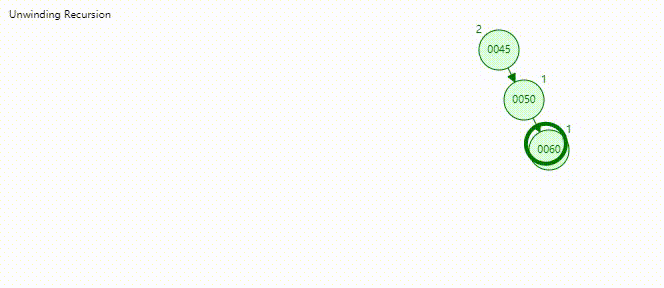
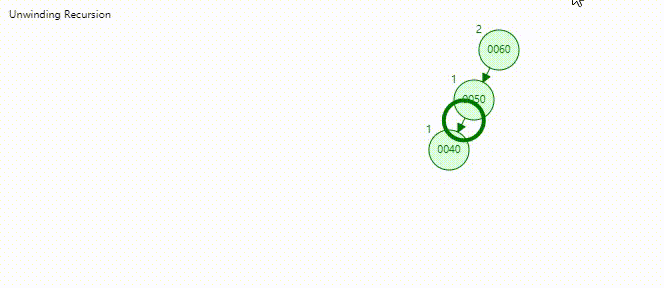
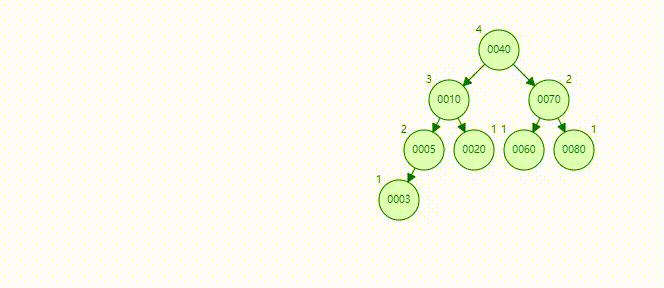
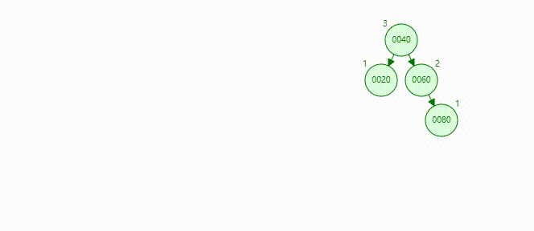

# Table of Contents

* [AVL树](#avl树)
  * [定义](#定义)
  * [结点](#结点)
  * [平衡因子](#平衡因子)
  * [旋转](#旋转)
    * [左旋](#左旋)
    * [右旋](#右旋)
  * [不平衡情况](#不平衡情况)
    * [LL](#ll)
    * [LR](#lr)
    * [RR](#rr)
    * [RL](#rl)
  * [插入](#插入)
  * [查询](#查询)
  * [删除](#删除)
    * [后继结点(替换结点)](#后继结点替换结点)
    * [删除结点的三种情况 (同二叉搜索树)](#删除结点的三种情况-同二叉搜索树)
    * [删除之后会导致不平衡](#删除之后会导致不平衡)


# AVL树

#### 初次阅读需要花费20-30分钟。有研究过的回顾大约需要5-10分钟，如果有时间和兴趣欢迎阅读和交流。如果想要自己实现，可以先阅读，然后大约需要花费1-2个小时对照和编码来实现。

我的[代码链接](https://github.com/yesbutter/code-skills/blob/master/%E6%95%B0%E6%8D%AE%E7%BB%93%E6%9E%84%E4%B8%8E%E7%AE%97%E6%B3%95/DS/%E5%AD%98%E5%82%A8%E7%BB%93%E6%9E%84/src/Tree/MyAVLTree.java)，欢迎讨论和交流。

## 定义

计算机科学中，AVL树是最先发明的自平衡二叉查找树。在AVL树中任何节点的两个子树的高度最大差别为1，所以它也被称为高度平衡树。增加和删除可能需要通过一次或多次树旋转来重新平衡这个树。

## 结点

```java
    static class AVLTreeNode<E extends Comparable<E>> {
        E data;
        protected AVLTreeNode<E> lChild, rChild;
        protected int height;

        public AVLTreeNode(E data) {
            this.data = data;
            this.lChild = this.rChild = null;
            this.height = 1;
        }
    }
```


## 平衡因子

在介绍之前需要介绍平衡因子的概念。是指当前节点的左子树高度 - 右子树高度。平衡因子 大于1 或者 小于-1 即为不平衡，则需要调整。

```java
    private static <E extends Comparable<E>> int getBalanceFactor(AVLTreeNode<E> node) {
        if (node == null)
            return 0;
        return getHeight(node.lChild) - getHeight(node.rChild);
    }
    
	//一个结点的告诉定义为
    private static <E extends Comparable<E>> int getHeight(AVLTreeNode<E> node) {
        if (node == null)
            return 0;
        return node.height;
    }
	
	//高度更新
    private void updateHeight(AVLTreeNode<E> node) {
        node.height = Math.max(getHeight(node.lChild), getHeight(node.rChild)) + 1;
    }
```

## 旋转

### 左旋

- 为什么需要左旋呢？

  在AVL树中为了解决平衡因子小于-1。如图。图中 45 不满足平衡因子

  

```java
	//仔细观察可以发现 左旋某一个节点，即为将当前结点的右孩子结点作为当前结点。(同时要保证其他节点也正确存放)
	//返回根节点
    private AVLTreeNode<E> leftRotate(AVLTreeNode<E> y) {
        //y即是图中的45
        AVLTreeNode<E> x = y.rChild;
        //保证图中50的左结点放在45的右边。
        AVLTreeNode<E> tmp3 = x.lChild;
        //左旋
        x.lChild = y;
        y.rChild = tmp3;

        //更新树高
        updateHeight(y);
        updateHeight(x);
        return x;
    }
```

### 右旋

- 为了解决平衡因子大于1。如图 图中60不满足平衡因子的定义



```java
    //仔细观察可以发现 右旋某一个节点，即为将当前结点的左孩子结点作为当前结点。(同时要保证其他节点也正确存放)
	//返回调整之后的根节点
	private AVLTreeNode<E> rightRotate(AVLTreeNode<E> y) {
        AVLTreeNode<E> x = y.lChild;
        AVLTreeNode<E> tmp3 = x.rChild;
        x.rChild = y;
        y.lChild = tmp3;

        updateHeight(y);
        updateHeight(x);
        return x;
    }
```


## 不平衡情况

- 这里这讨论不平衡因子为2 和-2的情况。(在计算中是从增加结点向上开始计算，不会出现不平衡因子溢出的情况)

  ### LL 

  - 即为右旋的介绍情况，这种情况只需要右旋即可保证平衡。

  ### LR

  插入4后5节点的平衡因子等于2。5的左节点的右结点这样成为LR。

  1.我们为了构造成LL的模样，我们可以节点3进行左旋，转变为LL型，。

  2.得到LL型，再右旋节点5。 可以保证4结点之后的平衡。

  

  ### RR

  - 即为左旋介绍情况，这种情况只需要左旋即可保证平衡。

  ### RL

  - 插入节点70后导致60的平衡因子为2。此时的路径是 60的右孩子的左左孩子。即为RL

    1.我们同样需要构造RR型。这时我们右旋结点80。可得RR型。

    2.左旋结点60可恢复60结点之下。可以保证70结点之后的平衡。



## 插入

- 我们都知道，插入结点之后会导致不平衡。这个不平衡是从插入节点开始的，直到根节点的一个不平衡。在实现上我们通过递归，来保证从插入点到根节点的一个平衡整理。

```java

    public void insert(E data) {
        // 通过返回来建立指向关系
        mRoot = add(mRoot, data);
    }

    /**
     * 返回平衡之后的根节点
     *
     * @param node
     * @param data
     * @return
     */
    private AVLTreeNode<E> insert(AVLTreeNode<E> node, E data) {
        if (node == null) {
            size++;
            return new AVLTreeNode<>(data);
        }
        //递归的查找插入位置
        if (data.compareTo(node.data) < 0) {
            // 建立左孩子节点的指向关系
            node.lChild = add(node.lChild, data);
        } else if (data.compareTo(node.data) > 0) {
            node.rChild = add(node.rChild, data);
        }
        updateHeight(node);
        int balanceFactor = getBalanceFactor(node);
        if (balanceFactor > 1 && getBalanceFactor(node.lChild) > 0) {
            //LL
            return rightRotate(node);
        } else if (balanceFactor < -1 && getBalanceFactor(node.rChild) < 0) {
            //RR
            return leftRotate(node);
        } else if (balanceFactor > 1 && getBalanceFactor(node.rChild) < 0) {
            //LR
            node.lChild = leftRotate(node.lChild);
            return rightRotate(node);
        } else if (balanceFactor < -1 && getBalanceFactor(node.lChild) > 0) {
            //RL
            node.rChild = rightRotate(node.rChild);
            return leftRotate(node);
        }
        //返回调整之后的根节点
        return node;
    }
```


## 查询

1. 当前节点是否为空，为空返回null,否则执行2

2. 判断当前节点的值与插入节点 ? 小于 ->3，大于 -> 4 等于 返回当前节点

3. 将当前节点赋值为当前节点的左子树，跳转到2

4. 将当前节点赋值为当前节点的右子树，跳转到2

   ```java
       public AVLTreeNode<E> search(E data) {
           return search(mRoot, data);
       }
   
       
       private AVLTreeNode<E> search(AVLTreeNode<E> node, E data) {
           while (node != null) {
               if (data.compareTo(node.data) > 0) {
                   node = node.rChild;
               } else if (data.compareTo(node.data) < 0) {
                   node = node.lChild;
               } else {
                   return node;
               }
           }
           return null;
       }
   ```

   

   

## 删除

### 后继结点(替换结点)

​	介绍删除之前需要了解一下后继节点。后继节点是指当前节点可替换结点。

- 定义：同二叉搜索树，当前结点交换为后继结点，不会影响二叉搜索树的性质的结点。

- 从当前结点的左右子树查找，左子树的最大值和右子树的最小值是替换结点(最好为高度最高的子树上的结点)。

- 如下图所示，80的左子树替换结点是78，左子树替换结点是82。交换之后仍然保存二叉树的性质。

  


```java
	//后继节点
    private AVLTreeNode<E> successor(AVLTreeNode<E> node) {
        AVLTreeNode<E> replaceTreeNode = null;
        //左右子树都不为空，寻找左右子树高度最高的。取左子树的最大值，右子树的最小值，替换
        if (node.rChild.height <= node.lChild.height) {
            replaceTreeNode = node.rChild;
            while (replaceTreeNode.lChild != null) {
                replaceTreeNode = replaceTreeNode.lChild;
            }
        } else {
            replaceTreeNode = node.lChild;
            while (replaceTreeNode.rChild != null) {
                replaceTreeNode = replaceTreeNode.rChild;
            }
        }
        return replaceTreeNode;
    }
```


### 删除结点的三种情况 (同二叉搜索树)

因为是一颗二叉树，所以一个结点。最多有三种情况，

- 左右子树都为空。 

- 左子树、右子树存在一个为空

- 左右子树都不为空

  case 1 : 直接删除当前结点，即可。如图删除结点20

  

  case 2 : 将当前结点和不为空的子树交换，即转变为状态1，即可删除。如图删除结点10

  

  

  case 3 : 寻找当前结点的交换结点(俩个均可),交换。交换之后删除结点即转变为状态2(或者2)。(因为是右子树的最小值，必定不会存在左节点。同理左子树) 。如图删除结点70

  

  

### 删除之后会导致不平衡

- 为了解决不平衡，我们需要判断平衡，根据情况，来实现平衡。(具体情况可自行分析或者查阅其他资料)

```java

    public void remove(E data) {
        if (data == null)
            throw new NullPointerException();
        mRoot = remove(mRoot, data);
    }

    //返回当前根节点
    private AVLTreeNode<E> remove(AVLTreeNode<E> node, E data) {
        if (node == null) {
            return null;
        }
        if (data.compareTo(node.data) > 0) {
            node.rChild = remove(node.rChild, data);
        } else if (data.compareTo(node.data) < 0) {
            node.lChild = remove(node.lChild, data);
        } else {
            size--;
            if (node.lChild == null || node.rChild == null) {
                return node.lChild == null ? node.rChild : node.lChild;
            }
            E successorKey = successor(node).data;
            node = remove(node, successorKey);
            node.data = successorKey;
        }
        updateHeight(node);
        int balanceFactor = getBalanceFactor(node);
        if (balanceFactor > 1 || balanceFactor < -1)
            node = balance(node);
        return node;
    }

	// 删除时调整平衡
    private AVLTreeNode<E> balance(AVLTreeNode<E> node) {
        int balanceFactor = getBalanceFactor(node);
        if (balanceFactor > 1 && getBalanceFactor(node.lChild) >= 0) {
            node = leftRotate(node);
        } else if (balanceFactor < -1 && getBalanceFactor(node.rChild) <= 0) {
            node = rightRotate(node);
        }
        return node;
    }
```


