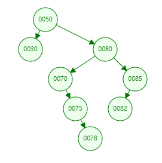

# Table of Contents

* [二叉搜索树](#二叉搜索树)
  * [定义](#定义)
  * [结点](#结点)
  * [插入](#插入)
  * [查询](#查询)
  * [删除](#删除)
    * [后继结点(替换结点)](#后继结点替换结点)
    * [删除结点的三种情况](#删除结点的三种情况)


# 二叉搜索树

#### 初次阅读需要花费10-20分钟。有研究过的回顾大约需要3-5分钟，如果有时间和兴趣欢迎阅读和交流。如果想要自己实现，可以先阅读，然后大约需要花费0.5-1个小时对照和编码来实现。

我的[代码链接](https://github.com/yesbutter/code-skills/blob/master/%E6%95%B0%E6%8D%AE%E7%BB%93%E6%9E%84%E4%B8%8E%E7%AE%97%E6%B3%95/DS/%E5%AD%98%E5%82%A8%E7%BB%93%E6%9E%84/src/Tree/MyBinSearchTree.java)，欢迎讨论和交流。

## 定义

它或者是一棵空树，或者是具有下列性质的二叉树： 若它的左子树不空，则左子树上所有结点的值均小于它的根结点的值； 若它的右子树不空，则右子树上所有结点的值均大于它的根结点的值； 它的左、右子树也分别为二叉排序树。二叉搜索树作为一种经典的数据结构，它既有链表的快速插入与删除操作的特点，又有数组快速查找的优势；


## 结点

```java
public class TreeNode<E> {
    E data;
    protected TreeNode<E> lChild;
    protected TreeNode<E> rChild;
    protected TreeNode<E> parent;

    public TreeNode() {
        this.lChild = null;
        this.rChild = null;
    }

    public TreeNode(E data) {
        this.data = data;
        this.lChild = null;
        this.rChild = null;
        this.parent = null;
    }
}
```


## 插入

1. 根节点赋值给当前节点

2. 当前节点是否为空，为空创建节点、建立指向、退出，否则执行3

3. 判断当前节点的值是否小于插入节点，是4，否5

4. 将当前节点赋值为当前节点的左子树，跳转到2

5. 将当前节点赋值为当前节点的右子树，跳转到2

   退出条件是找到一个可以插入的节点。
   
   ```java
   
       public void add(E data) {
           if (mRoot == null) {
               mRoot = new TreeNode<>(data);
               size++;
               return;
           }
           add(mRoot, data);
       }
   
   
       public void add(TreeNode<E> node, E data) {
           TreeNode<E> treeNode = node;
           TreeNode<E> position = null;
           while (treeNode != null) {
               position = treeNode;
               if (data.compareTo(treeNode.data) > 0) {
                   treeNode = treeNode.rChild;
               } else {
                   treeNode = treeNode.lChild;
               }
           }
           TreeNode<E> newNode = new TreeNode<>(data);
           //建立连接
           newNode.parent = position;
           if (position == null)
               mRoot = newNode;
           else {
               if (data.compareTo(position.data) > 0) {
                   position.rChild = newNode;
               } else {
                   position.lChild = newNode;
               }
           }
       }
   ```
   
   

## 查询

1. 当前节点是否为空，为空返回null,否则执行2

2. 判断当前节点的值与插入节点 ? 小于 ->3，大于 -> 4 等于 返回当前节点

3. 将当前节点赋值为当前节点的左子树，跳转到2

4. 将当前节点赋值为当前节点的右子树，跳转到2

   ```java
       public TreeNode<E> search(E data) {
           return search(mRoot, data);
       }
   
       private TreeNode<E> search(TreeNode<E> node, E data) {
           while (node != null) {
               if (data.compareTo(node.data) > 0) {
                   node = node.rChild;
               } else if (data.compareTo(node.data) < 0) {
                   node = node.lChild;
               } else {
                   return node;
               }
           }
           return null;
       }
   ```

   

   

## 删除

### 后继结点(替换结点)

​	介绍删除之前需要了解一下后继节点。后继节点是指当前节点可替换结点。

- 定义：当前结点交换为后继结点，不会影响二叉搜索树的性质的结点。

- 从当前结点的左右子树查找，左子树的最大值和右子树的最小值是替换结点。

- 如下图所示，80的左子树替换结点是78，左子树替换结点是82。交换之后仍然保存二叉树的性质。

  



```java
    public static <E> TreeNode<E> successor(TreeNode<E> node) {
        if (node == null || (node.lChild == null && node.rChild == null))
            return null;
        TreeNode<E> value;
        if (node.rChild != null) {
            value = node.rChild;
            while (value.lChild != null)
                value = value.lChild;
        } else {
            value = node.lChild;
            while (value.rChild != null)
                value = value.rChild;
        }
        return value;
    }
```


### 删除结点的三种情况

因为是一颗二叉树，所以一个结点。最多有三种情况，

- 左右子树都为空。 

- 左子树、右子树存在一个为空

- 左右子树都不为空

  case 1 : 直接删除当前结点，即可。

  case 2 : 将当前结点和不为空的子树交换，即转变为状态1，即可删除。如图删除结点80

  
  
  ​			删除结点125
  
  
  
  
  
  case 3 : 寻找当前结点的交换结点(俩个均可),交换。交换之后删除结点即转变为状态2(或者2)。(因为是右子树的最小值，必定不会存在左节点。同理左子树) 。如图删除结点100
  
  
  
  
  
  

```java
    public TreeNode<E> remove(E data) {
        //首先要查找到这个数字,只会删除出现的第一次
        TreeNode<E> treeNode = search(data);
        if (treeNode == null)
            return null;
        return remove(treeNode);
    }
    
    
    public TreeNode<E> remove(TreeNode<E> node) {
        if (node.lChild != null && node.rChild != null) {
            //左右节点都在，找右子树中最小的元素交换值。case 3
            TreeNode<E> minTreeNode = successof(node);
            minTreeNode.data = node.data;
            node = minTreeNode;
        }

        TreeNode<E> child;
        if (node.lChild != null)
            child = node.lChild;
        else
            child = node.rChild;
        if (child != null) {
            //节点交换
            child.parent = node.parent;
        }
        //如果当前节点没有父节点，表示是跟结点
        //断开之前连接
        if (node.parent == null) {
            mRoot = child;
        } else if (node == node.parent.lChild) {
            node.parent.lChild = child;
        } else {
            node.parent.rChild = child;
        }
        return node;
    }

```


