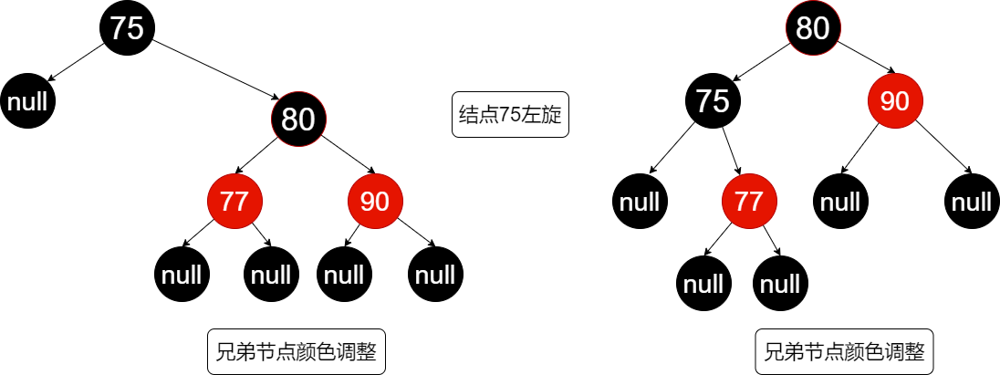
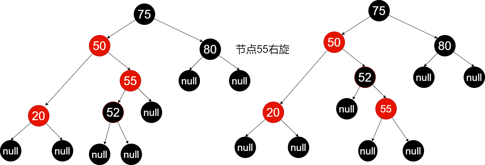
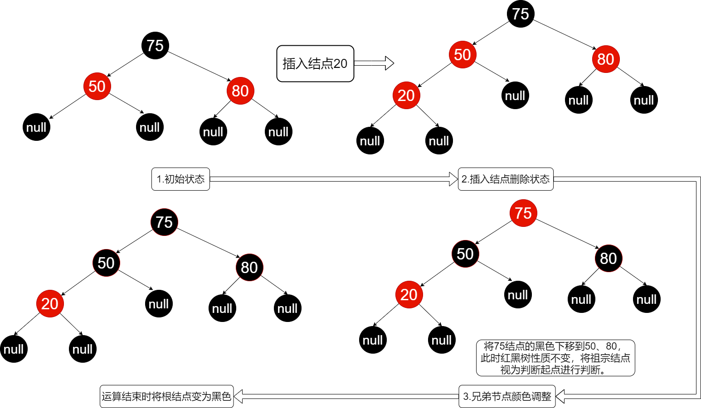
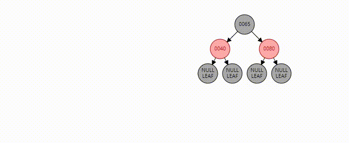
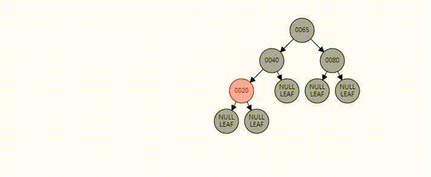
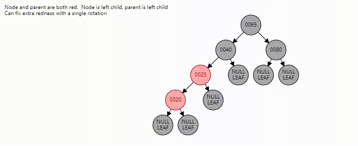
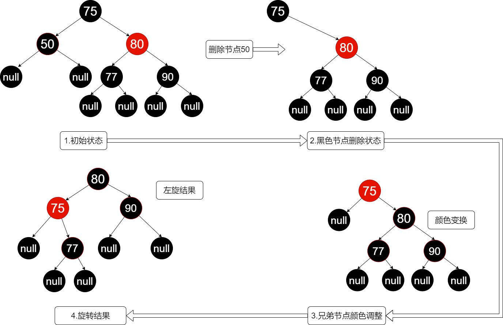
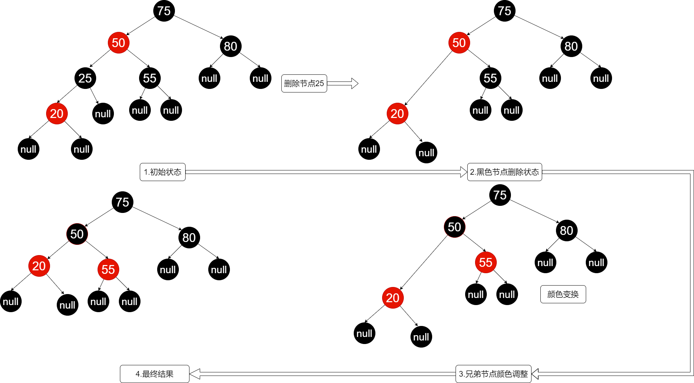
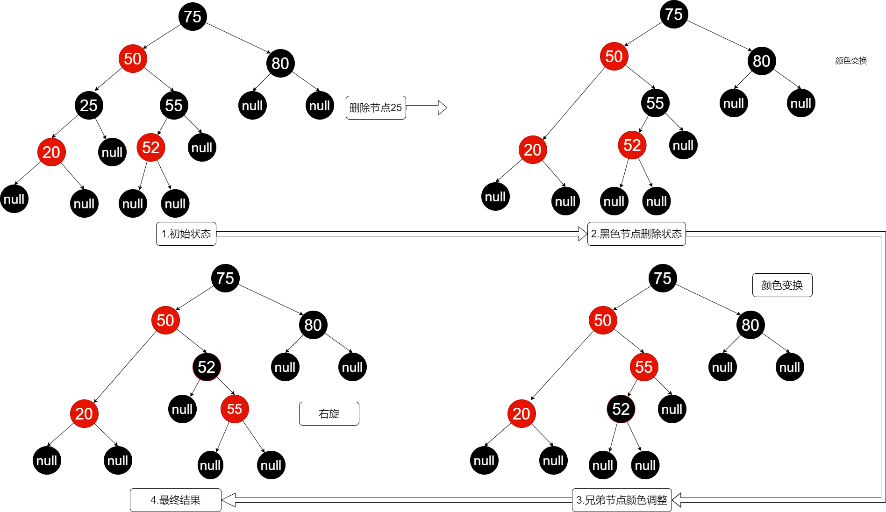
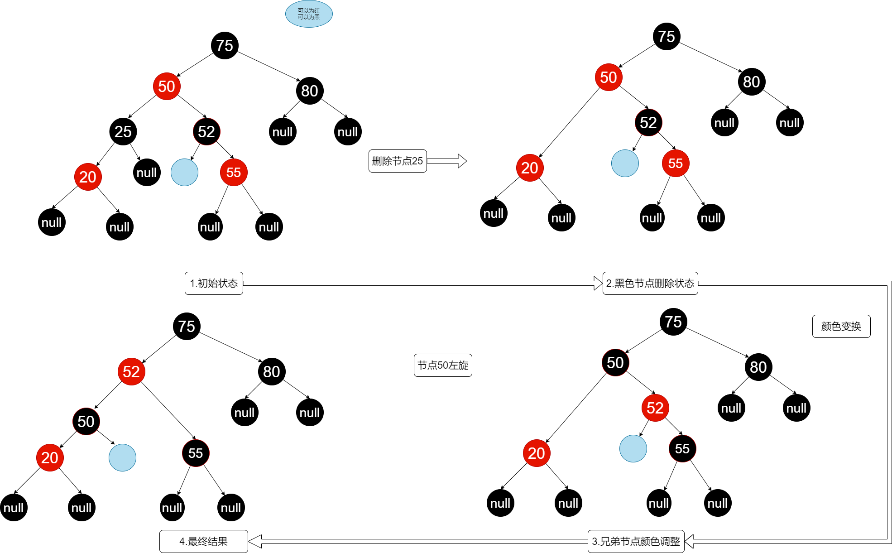

# Table of Contents

* [红黑树](#红黑树)
  * [定义](#定义)
  * [结点](#结点)
  * [旋转(同AVL树)](#旋转同avl树)
    * [左旋](#左旋)
    * [右旋](#右旋)
  * [防止空指针](#防止空指针)
  * [插入](#插入)
    * [插入平衡](#插入平衡)
      * [怎么样会出现不平衡?](#怎么样会出现不平衡)
  * [查询](#查询)
  * [删除](#删除)
    * [后继结点(替换结点)(定义同二叉搜索树)](#后继结点替换结点定义同二叉搜索树)
    * [删除结点的三种情况 (同二叉搜索树)](#删除结点的三种情况-同二叉搜索树)
    * [删除之后会导致不平衡](#删除之后会导致不平衡)


# 红黑树

#### 初次阅读需要花费40-50分钟。有研究过的回顾大约需要10-20分钟，如果有时间和兴趣欢迎阅读和交流。如果想要自己实现，可以先阅读，然后大约需要花费3-4个小时对照和编码来实现。

我的[代码链接](https://github.com/yesbutter/code-skills/blob/master/%E6%95%B0%E6%8D%AE%E7%BB%93%E6%9E%84%E4%B8%8E%E7%AE%97%E6%B3%95/DS/%E5%AD%98%E5%82%A8%E7%BB%93%E6%9E%84/src/Tree/RBTree.java)，欢迎讨论和交流。

## 定义

红黑树（Red Black Tree） 是一种自平衡二叉搜索树，是在计算机科学中用到的一种数据结构。

- 1.每个节点要么黑色，要么红色
- 2.根节点是黑色
- 3.每个叶子节点是黑色
- 4.如果一个节点是红色的，则它的子节点必须是黑色的。(不存在连续俩个红色节点)
- 5.从一个节点到该节点的子孙节点的所有路径上包含相同数目的黑色节点
  - 首先是一个二叉搜索树，其次是要满足自平衡，和以上5个定义
  - 需要重点理解定义4和5 

## 结点

```java

    private static final boolean RED = false;
    private static final boolean BLACK = true;

    static class RBTreeNode<E extends Comparable<E>> {
        boolean color; //颜色
        E data;
        RBTreeNode<E> lChild, rChild, parent;

        public RBTreeNode(E data) {
            this.data = data;
            this.color = RED;
            this.parent = this.lChild = this.rChild = null;
        }

        public RBTreeNode(boolean color, E data, RBTreeNode<E> lChild, RBTreeNode<E> rChild, RBTreeNode<E> parent) {
            this.color = color;
            this.data = data;
            this.lChild = lChild;
            this.rChild = rChild;
            this.parent = parent;
        }

        public E getData() {
            return data;
        }

        @Override
        public String toString() {
            return "RBTreeNode{" +
                    "color=" + (color ? "BLACK" : "RED") +
                    ", data=" + data +
                    '}';
        }
    }
```


## 旋转(同AVL树)

### 左旋

- 为什么需要左旋呢？

  左旋是为了当前结点的右子树黑色结点减一。

  对结点75进行左旋。旋转前75到叶子节点的左边是2个黑色，到右边是3个黑色。

  旋转后80结点 到叶子结点左边是2个，右边是2个。为了保证性质5.

  

```java
	//左旋，需要修改指向关系，可以手动模拟一遍会加深印象。
    private void leftRotate(RBTreeNode<E> x) {
        if (x != null) {
            RBTreeNode<E> y = x.rChild;

            //修改y的lChild 指向x 。 
            //这里需要理解引用的内容，只修改变量不修改引用，不会产生指向关系，原指向关系依然不变。
            x.rChild = y.lChild;
            if (y.lChild != null) {
                y.lChild.parent = x;
            }

            //修改x父亲指向x的关系 fax<----->x  fax<---->y
            y.parent = x.parent;
            if (x.parent == null) {
                mRoot = y;
            } else if (x.parent.lChild == x) {
                x.parent.lChild = y;
            } else {
                x.parent.rChild = y;
            }

            //建立 yx指向关系
            y.lChild = x;
            x.parent = y;
        }
    }
```

### 右旋

- 右旋是为了当前结点的左子树黑色结点减一。

  对结点55进行右旋。旋转前55到叶子节点的左边是2个黑色，到右边是1个黑色。

  旋转后52结点 到叶子结点左边是1个，右边是1个。保证了性质5.



```java
	//右旋
    private void rightRotate(RBTreeNode<E> x) {
        if (x != null) {
            RBTreeNode<E> y = x.lChild;

            //修改x左结点指向 y的右孩子
            x.lChild = y.rChild;
            if (y.rChild != null) {
                y.rChild.parent = x;
            }

            //修改y的右结点为x
            y.parent = x.parent;
            if (x.parent == null) {
                mRoot = y;
            } else if (x.parent.lChild == x) {
                x.parent.lChild = y;
            } else {
                x.parent.rChild = y;
            }

            //修改y的右结点指向x
            y.rChild = x;
            x.parent = y;
        }
    }
```


## 防止空指针

```java
    private static <E extends Comparable<E>> boolean colorOf(RBTreeNode<E> p) {
        return p == null ? BLACK : p.color;
    }


    private static <E extends Comparable<E>> RBTreeNode<E> leftOf(RBTreeNode<E> p) {
        return p == null ? null : p.lChild;
    }

    private static <E extends Comparable<E>> RBTreeNode<E> rightOf(RBTreeNode<E> p) {
        return p == null ? null : p.rChild;
    }

    private static <E extends Comparable<E>> RBTreeNode<E> parentOf(RBTreeNode<E> p) {
        return p == null ? null : p.parent;
    }
```


## 插入

- 首先我们插入的如果是根结点，我们把他染成黑色即可结束。
- 我们每次插入的结点为红色。(为了保证性质5,尽可能少的增加黑色结点。)
- 插入代码略

### 插入平衡

#### 怎么样会出现不平衡?

1.首先我们插入的结点是红色。如果我们插入结点的**父节点**是黑色，则不会破坏任何性质。

如果我们插入结点的**父结点**是红色，会破坏性质4，为了保证性质4我们需要进行平衡。

- 如果我们插入的父结点是黑色，则即可返回。因为满足所有性质。如果是红色，会破坏性质4。

  可以分为6种情况。来恢复平衡。其中前三种和后三种互为镜像关系，所以只介绍前三种

- 我们需要插入结点的父节点(父结点)，父节点的父节点(祖宗结点),父节点的兄弟结点(叔叔结点)

- 首先我们已知，当前结点，父结点 为红色。 性质4可得 祖宗结点为黑色。

  - case1 : 如果叔叔结点也是红色，我们可以将祖宗结点的黑色下移到父、叔结点。

    
    
    
    
    流程图如下：
    
    
    
  - case 2 : 叔叔结点是黑色，并且插入的父结点是右子树。
  
    我们需要左旋父结点。即为图所示，左旋20结点。并保证当前结点指向的是20。
  
    此次操作是中间操作，为了得到case3的情况。

                                      


  - - case 3 : 叔叔结点是黑色，并且插入的父结点是右子树。当前结点是20

​				将父亲结点改为黑色，祖父结点改为红色。此时祖父结点的左边黑色结点多1。

​                我们为了满足红黑树的性质，将祖父结点进行右旋。此时已经满足红黑树的所有性质




  - - case 4 : 父结点是祖父结点的右结点。情况同1镜像对称
    - case 5 : 同2镜像对称，需要注意判断和旋转
    - case 6 : 同3镜像对称，需要注意旋转

```java

    /**
     * 插入元素之后平衡红黑树
     * @param node
     */
    private void fixAfterInsertion(RBTreeNode<E> node) {
        //若 父节点存在，并且父节点的颜色是红色
        while (node != null && node != mRoot && colorOf(parentOf(node)) == RED) {
            //若 "父节点"是"祖父节点的左孩子"
            if (parentOf(node) == leftOf(parentOf(parentOf(node)))) {
                RBTreeNode<E> uncle = rightOf(parentOf(parentOf(node)));
                /**
                 * case 1 :
                 * 当前节点和父节点都为红色，破坏性质4
                 * 叔叔节点是红色 父节点是红色，
                 * 由性质4可得 祖父节点是黑色。
                 * 祖父 - 父 - 当 (黑 -> 红  -> 红)
                 * 交换 祖父节点 和 (父节点、叔节点)颜色
                 * 祖父 - 父 - 当 (红 -> 黑  -> 红)  (当前祖父向下链满足性质4)
                 * 向上回溯 将祖父节点作为当前起点
                 */
                if (colorOf(uncle) == RED) {
                    setColor(uncle, BLACK);
                    setColor(parentOf(node), BLACK);
                    setColor(parentOf(parentOf(node)), RED);
                    node = parentOf(parentOf(node));
                } else {
                    /**
                     * case 2 : 当前节点是右孩子
                     * 叔叔节点是黑色，父亲节点是红色               黑
                     * 由性质4可得 祖父节点也是黑色             红       黑        ->父节点进行左旋 改变形状为case3
                     * 祖父 - 父 - 当 (黑 -> 红 -> 红)      t1  红(当) t2  t3
                     * 由性质4可以得到t1是黑色。
                     * 此时只能通过左旋父节点 转变为状态3 再进行调整。
                     * 当前节点向上移为父节点
                     */
                    if (rightOf(parentOf(node)) == node) {
                        node = parentOf(node);
                        leftRotate(parentOf(node));
                    }
                    /**
                     * case 3 : 当前节点是左孩子
                     * 叔叔节点是黑色，父亲节点是红色                黑
                     * 由性质4可得 祖父节点也是黑色              红       黑        ->组父节点进行右旋
                     * 祖父 - 父 - 当 (黑 -> 红 -> 红)      红(当) t1  t2  t3
                     * 此时通过调整颜色，右旋祖父节点保证红黑树性质
                     */
                    setColor(parentOf(node), BLACK);
                    setColor(parentOf(parentOf(node)), RED);
                    rightRotate(parentOf(parentOf(node)));
                }
            } else {
                // 镜像case1,2,3
                //case 4 :叔叔节点是红色
                RBTreeNode<E> uncle = leftOf(parentOf(parentOf(node)));
                if (colorOf(uncle) == RED) {
                    setColor(uncle, BLACK);
                    setColor(parentOf(node), BLACK);
                    setColor(parentOf(parentOf(node)), RED);
                    node = parentOf(parentOf(node));
                } else {
                    //case 5: 叔叔节点是黑色，且当前节点是左孩子
                    if (leftOf(parentOf(node)) == node) {
                        node = parentOf(node);
                        leftRotate(parentOf(node));
                    }
                    //case 6条件:叔叔是黑色，且当前结点是右孩子
                    setColor(parentOf(node), BLACK);
                    setColor(parentOf(parentOf(node)), RED);
                    leftRotate(parentOf(parentOf(node)));
                }
            }
        }
        setColor(mRoot, BLACK);
    }
```


## 查询

1. 当前节点是否为空，为空返回null,否则执行2

2. 判断当前节点的值与插入节点 ? 小于 ->3，大于 -> 4 等于 返回当前节点

3. 将当前节点赋值为当前节点的左子树，跳转到2

4. 将当前节点赋值为当前节点的右子树，跳转到2

   ```java
       /**
        * 查找一个元素
        * @param data
        * @return
        */
       public RBTreeNode<E> search(E data) {
           if (data == null)
               throw new NullPointerException();
           RBTreeNode<E> node = mRoot;
           int cmp = 0;
           while (node != null) {
               cmp = data.compareTo(node.data);
               if (cmp < 0) {
                   node = node.lChild;
               } else if (cmp > 0) {
                   node = node.rChild;
               } else {
                   return node;
            }
           }
        return null;
       }
   ```
   
   
   
   

## 删除

### 后继结点(替换结点)(定义同二叉搜索树)

​	介绍删除之前需要了解一下后继节点。后继节点是指当前节点可替换结点。

- 定义：同二叉搜索树，当前结点交换为后继结点，不会影响二叉搜索树的性质的结点。

- 从当前结点的左右子树查找，左子树的最大值和右子树的最小值是替换结点(最好为高度最高的子树上的结点)。

  


```java
    /**
     * 计算当前节点的替换节点(交换值不会影响二叉搜索树的定义节点)
     * @param node
     * @return
     */
    private RBTreeNode<E> successor(RBTreeNode<E> node) {
        if (node == null)
            return null;
        else if (node.rChild != null) {
            RBTreeNode<E> replace = node.rChild;
            while (replace.lChild != null) {
                replace = replace.lChild;
            }
            return replace;
        } else {
            RBTreeNode<E> replace = node.lChild;
            while (replace.rChild != null) {
                replace = replace.rChild;
            }
            return replace;
        }
    }
```


### 删除结点的三种情况 (同二叉搜索树)

因为是一颗二叉树，所以一个结点。最多有三种情况，

- 左右子树都为空。 

- 左子树、右子树存在一个为空

- 左右子树都不为空

  

### 删除之后会导致不平衡

- 什么情况会出现不平衡？

  由红黑树的性质可得，如果**删除的结点**(要考虑是删除的，在删除情况3是会转化删除的结点的，会发生删除结点的转换)是红色，不会影响红黑树的性质。

  那么我们需要细分一下那些会发生删除黑结点的情况。

  1.替换之后删除的是黑色的。(即删除情况的第二、三种)

  2.删除的结点是黑色，并且左右子树都为空。(即删除情况的第一种)

  - **删除黑色结点会破坏性质5，父节点到左右子树根节点的黑色个数差2(为什么是2可以画图来思考一下，提示 注意画空结点)。

  下面我们还需要细分删除的是黑色结点的情况。共有8种，成镜像关系，所以分析4种

  **以删除的结点是在父结点的左子树为例**

  case 1. 删除结点的兄弟结点是红色,将兄弟结点边为黑色，父亲结点变为红色,如图。

  

  case 2. 兄弟结点是黑色，兄弟结点的左右孩子也是黑色。

  第三步为将兄弟结点边为红色，此时右边就少一个黑色结点。(当前结点符合红黑树)

  

  case 3 :兄弟结点是黑色，兄弟结点的右子树是黑色，左子树是红色。

  第三步颜色变化为将兄弟结点变为红色，将兄弟节点的右子树变为黑色。(50违反规则4，5)

  第四步为将55结点进行右旋。此时仍是不平衡状态。(50违法规则4，5)**目的是为了得到case4的状态2。**

  

  case 4:兄弟结点是黑色，兄弟结点的右子树是红色，左子树是任意颜色。

  第三步 颜色变换为将兄弟结点变为父结点的颜色，将父结点变为黑色，将兄弟结点的右结点变为黑色。(50报告向上的结点不满足性质5，左边为1，右边为2)

  第四步 对父节点进行左旋，(50的黑色下移，新的结点52的左右子树达到平衡，从50算左右俩边都为2)。

  

  case 5,6,7,8。分别为当前子树为右子树的镜像。可以自行研究。

  

```java
        /**
     * 移除一个元素
     * @param node
     */
    private void remove(RBTreeNode<E> node) {
        size--;
        if (node.rChild != null && node.lChild != null) {
            //寻找取代节点
            RBTreeNode<E> replaceNode = successor(node);
            node.data = replaceNode.data;
            node = replaceNode;
        }
        RBTreeNode<E> replace = (node.lChild == null ? node.rChild : node.lChild);
        if (replace != null) {
            //删除点p只有一颗子树非空
            if (node.parent == null) {
                mRoot = replace;
            } else if (node == node.parent.lChild) {
                node.parent.lChild = replace;
            } else {
                node.parent.rChild = replace;
            }
            //删除引用关系
            node.lChild = node.rChild = node.parent = null;
            if (node.color == BLACK) {
                fixAfterDeletion(replace);
            }
        } else if (node.parent == null) {
            //删除的节点是根节点
            mRoot = null;
        } else {
            //删除节点左右子树都为空
            if (node.color == BLACK)
                fixAfterDeletion(node);
            if (node.parent != null) {
                if (node == node.parent.lChild) {
                    node.parent.lChild = null;
                } else if (node == node.parent.rChild) {
                    node.parent.rChild = null;
                }
                node.parent = null;
            }
        }
    }
	/**
     * 删除元素之后平衡
     * @param x
     */
    private void fixAfterDeletion(RBTreeNode<E> x) {
        while (x != mRoot && colorOf(x) == BLACK) {
            if (x == leftOf(parentOf(x))) {
                RBTreeNode<E> brother = rightOf(parentOf(x));
                if (colorOf(brother) == RED) {
                    //情况1 兄弟节点是红色
                    setColor(brother, BLACK);
                    setColor(parentOf(x), RED);

                    leftRotate(parentOf(x));
                    brother = rightOf(parentOf(x));
                }
                if (colorOf(leftOf(brother)) == BLACK &&
                        colorOf(rightOf(brother)) == BLACK) {
                    //情况2 兄弟节点是黑色 兄弟结点的左右孩子都是黑色
                    setColor(brother, RED);
                    x = parentOf(x);
                } else {
                    if (colorOf(rightOf(brother)) == BLACK) {
                        //情况3 兄弟节点是黑色 兄弟结点的右孩子是黑色

                        setColor(leftOf(brother), BLACK);
                        setColor(brother, RED);
                        rightRotate(brother);
                        brother = rightOf(parentOf(x));
                    }
                    //情况4
                    setColor(brother, colorOf(parentOf(x)));

                    setColor(parentOf(x), BLACK);
                    setColor(rightOf(brother), BLACK);
                    leftRotate(parentOf(x));
                    x = mRoot;
                }
            } else {
                //与之前成镜像关系
                RBTreeNode<E> brother = x.parent.lChild;
                if (colorOf(brother) == RED) {
                    //情况5 兄弟节点是红色
                    setColor(brother, BLACK);

                    setColor(parentOf(x), RED);
                    rightRotate(parentOf(x));
                    brother = leftOf(parentOf(x));
                }
                if (colorOf(leftOf(brother)) == BLACK &&
                        colorOf(rightOf(brother)) == BLACK) {
                    //情况6 兄弟节点是黑色 兄弟节点的左右孩子是黑色
                    setColor(brother, RED);
                    x = parentOf(x);
                } else {
                    if (colorOf(leftOf(brother)) == BLACK) {
                        //情况7 兄弟节点是黑色 兄弟结点 左右孩子都是黑色
                        setColor(rightOf(brother), BLACK);
                        setColor(brother, RED);
                        rightRotate(brother);
                        brother = leftOf(parentOf(x));
                    }
                    //情况8

                    setColor(brother, colorOf(parentOf(x)));
                    setColor(parentOf(x), BLACK);
                    setColor(leftOf(brother), BLACK);
                    rightRotate(parentOf(x));
                    x = mRoot;
                }
            }
        }
        setColor(x, BLACK);
    }
```


